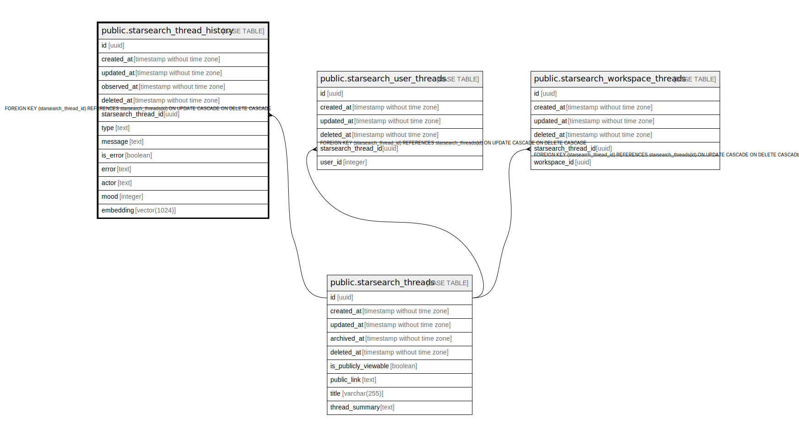

# public.starsearch_thread_history

## Description

## Columns

| Name                 | Type                        | Default            | Nullable | Children | Parents                                                   | Comment |
| -------------------- | --------------------------- | ------------------ | -------- | -------- | --------------------------------------------------------- | ------- |
| id                   | uuid                        | uuid_generate_v4() | false    |          |                                                           |         |
| created_at           | timestamp without time zone | now()              | false    |          |                                                           |         |
| updated_at           | timestamp without time zone | now()              | false    |          |                                                           |         |
| observed_at          | timestamp without time zone |                    | true     |          |                                                           |         |
| deleted_at           | timestamp without time zone |                    | true     |          |                                                           |         |
| starsearch_thread_id | uuid                        |                    | false    |          | [public.starsearch_threads](public.starsearch_threads.md) |         |
| type                 | text                        |                    | true     |          |                                                           |         |
| message              | text                        |                    | true     |          |                                                           |         |
| is_error             | boolean                     | false              | true     |          |                                                           |         |
| error                | text                        |                    | true     |          |                                                           |         |
| actor                | text                        |                    | true     |          |                                                           |         |
| mood                 | integer                     | 0                  | true     |          |                                                           |         |
| embedding            | vector(1024)                | NULL::vector       | true     |          |                                                           |         |

## Constraints

| Name                                                | Type        | Definition                                                                                               |
| --------------------------------------------------- | ----------- | -------------------------------------------------------------------------------------------------------- |
| starsearch_thread_history_starsearch_thread_id_fkey | FOREIGN KEY | FOREIGN KEY (starsearch_thread_id) REFERENCES starsearch_threads(id) ON UPDATE CASCADE ON DELETE CASCADE |
| starsearch_thread_history_pkey                      | PRIMARY KEY | PRIMARY KEY (id)                                                                                         |

## Indexes

| Name                                    | Definition                                                                                                                  |
| --------------------------------------- | --------------------------------------------------------------------------------------------------------------------------- |
| starsearch_thread_history_pkey          | CREATE UNIQUE INDEX starsearch_thread_history_pkey ON public.starsearch_thread_history USING btree (id)                     |
| starsearch_thread_history_idx_id        | CREATE INDEX starsearch_thread_history_idx_id ON public.starsearch_thread_history USING btree (id)                          |
| starsearch_thread_history_idx_thread_id | CREATE INDEX starsearch_thread_history_idx_thread_id ON public.starsearch_thread_history USING btree (starsearch_thread_id) |

## Relations

---

> Generated by [tbls](https://github.com/k1LoW/tbls)
