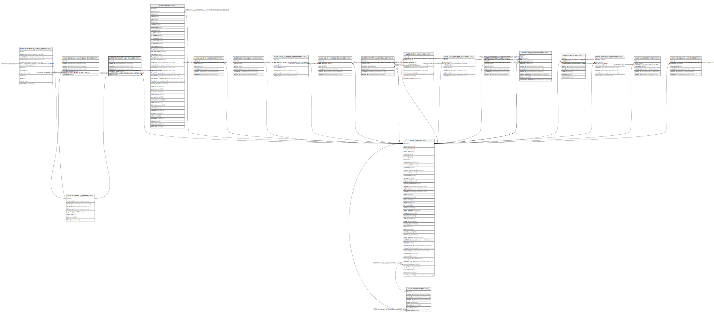

# public.starsearch_user_threads

## Description

## Columns

| Name                 | Type                        | Default            | Nullable | Children | Parents                                                   | Comment |
| -------------------- | --------------------------- | ------------------ | -------- | -------- | --------------------------------------------------------- | ------- |
| id                   | uuid                        | uuid_generate_v4() | false    |          |                                                           |         |
| created_at           | timestamp without time zone | now()              | false    |          |                                                           |         |
| updated_at           | timestamp without time zone | now()              | false    |          |                                                           |         |
| deleted_at           | timestamp without time zone |                    | true     |          |                                                           |         |
| starsearch_thread_id | uuid                        |                    | false    |          | [public.starsearch_threads](public.starsearch_threads.md) |         |
| user_id              | integer                     |                    | false    |          | [public.users](public.users.md)                           |         |

## Constraints

| Name                                              | Type        | Definition                                                                                               |
| ------------------------------------------------- | ----------- | -------------------------------------------------------------------------------------------------------- |
| starsearch_user_threads_user_id_fkey              | FOREIGN KEY | FOREIGN KEY (user_id) REFERENCES users(id) ON UPDATE CASCADE ON DELETE CASCADE                           |
| starsearch_user_threads_starsearch_thread_id_fkey | FOREIGN KEY | FOREIGN KEY (starsearch_thread_id) REFERENCES starsearch_threads(id) ON UPDATE CASCADE ON DELETE CASCADE |
| starsearch_user_threads_pkey                      | PRIMARY KEY | PRIMARY KEY (id)                                                                                         |

## Indexes

| Name                                  | Definition                                                                                                              |
| ------------------------------------- | ----------------------------------------------------------------------------------------------------------------------- |
| starsearch_user_threads_pkey          | CREATE UNIQUE INDEX starsearch_user_threads_pkey ON public.starsearch_user_threads USING btree (id)                     |
| starsearch_user_threads_idx_id        | CREATE INDEX starsearch_user_threads_idx_id ON public.starsearch_user_threads USING btree (id)                          |
| starsearch_user_threads_idx_user_id   | CREATE INDEX starsearch_user_threads_idx_user_id ON public.starsearch_user_threads USING btree (user_id)                |
| starsearch_user_threads_idx_thread_id | CREATE INDEX starsearch_user_threads_idx_thread_id ON public.starsearch_user_threads USING btree (starsearch_thread_id) |

## Relations

---

> Generated by [tbls](https://github.com/k1LoW/tbls)
