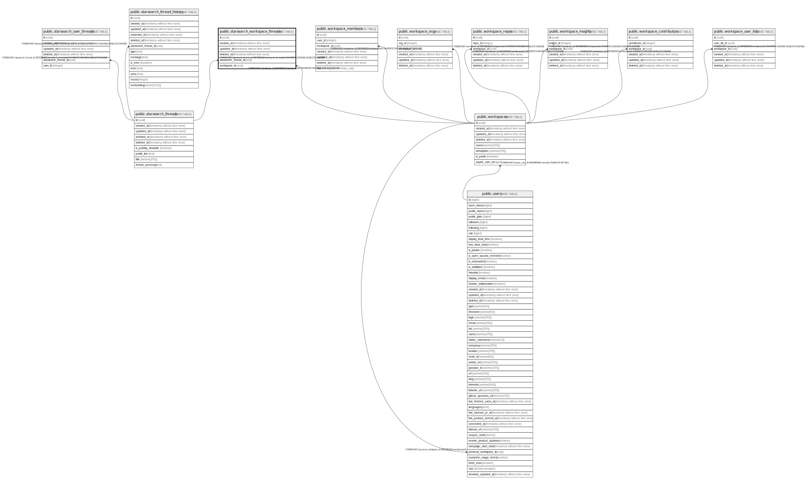

# public.starsearch_workspace_threads

## Description

## Columns

| Name                 | Type                        | Default            | Nullable | Children | Parents                                                   | Comment |
| -------------------- | --------------------------- | ------------------ | -------- | -------- | --------------------------------------------------------- | ------- |
| id                   | uuid                        | uuid_generate_v4() | false    |          |                                                           |         |
| created_at           | timestamp without time zone | now()              | false    |          |                                                           |         |
| updated_at           | timestamp without time zone | now()              | false    |          |                                                           |         |
| deleted_at           | timestamp without time zone |                    | true     |          |                                                           |         |
| starsearch_thread_id | uuid                        |                    | false    |          | [public.starsearch_threads](public.starsearch_threads.md) |         |
| workspace_id         | uuid                        |                    | false    |          | [public.workspaces](public.workspaces.md)                 |         |

## Constraints

| Name                                                   | Type        | Definition                                                                                               |
| ------------------------------------------------------ | ----------- | -------------------------------------------------------------------------------------------------------- |
| starsearch_workspace_threads_workspace_id_fkey         | FOREIGN KEY | FOREIGN KEY (workspace_id) REFERENCES workspaces(id) ON UPDATE CASCADE ON DELETE CASCADE                 |
| starsearch_workspace_threads_starsearch_thread_id_fkey | FOREIGN KEY | FOREIGN KEY (starsearch_thread_id) REFERENCES starsearch_threads(id) ON UPDATE CASCADE ON DELETE CASCADE |
| starsearch_workspace_threads_pkey                      | PRIMARY KEY | PRIMARY KEY (id)                                                                                         |

## Indexes

| Name                                          | Definition                                                                                                                        |
| --------------------------------------------- | --------------------------------------------------------------------------------------------------------------------------------- |
| starsearch_workspace_threads_pkey             | CREATE UNIQUE INDEX starsearch_workspace_threads_pkey ON public.starsearch_workspace_threads USING btree (id)                     |
| starsearch_workspace_threads_idx_id           | CREATE INDEX starsearch_workspace_threads_idx_id ON public.starsearch_workspace_threads USING btree (id)                          |
| starsearch_workspace_threads_idx_workspace_id | CREATE INDEX starsearch_workspace_threads_idx_workspace_id ON public.starsearch_workspace_threads USING btree (workspace_id)      |
| starsearch_workspace_threads_idx_thread_id    | CREATE INDEX starsearch_workspace_threads_idx_thread_id ON public.starsearch_workspace_threads USING btree (starsearch_thread_id) |

## Relations

---

> Generated by [tbls](https://github.com/k1LoW/tbls)
